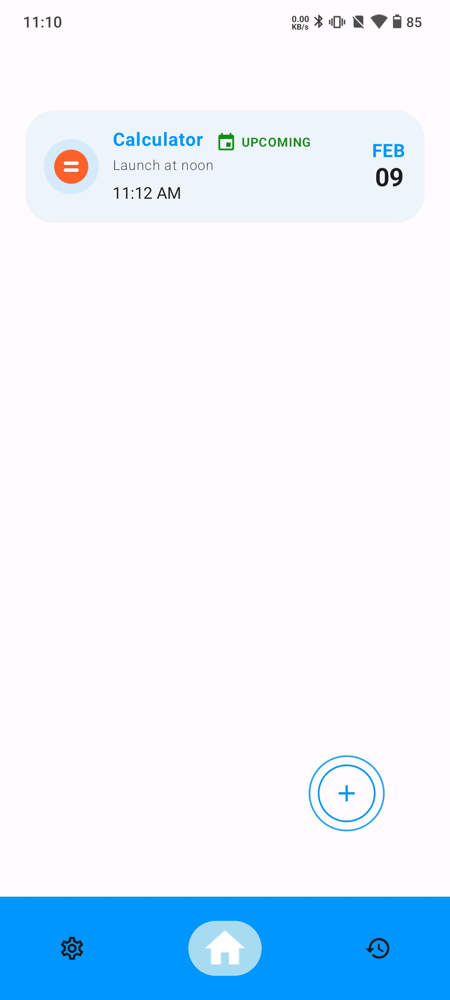
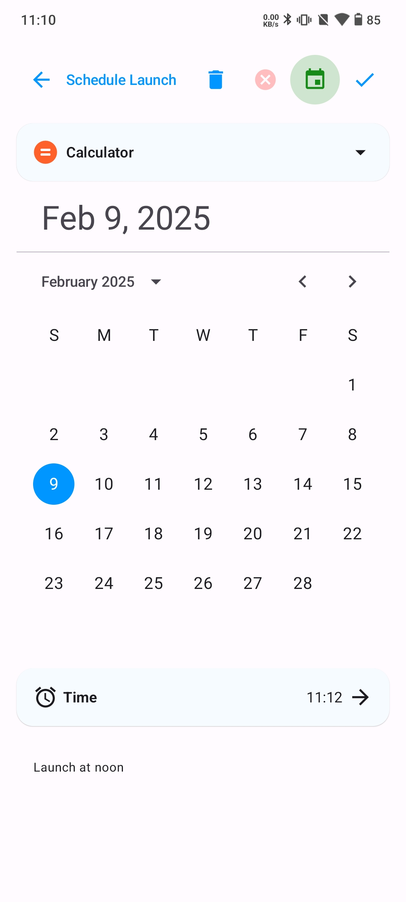
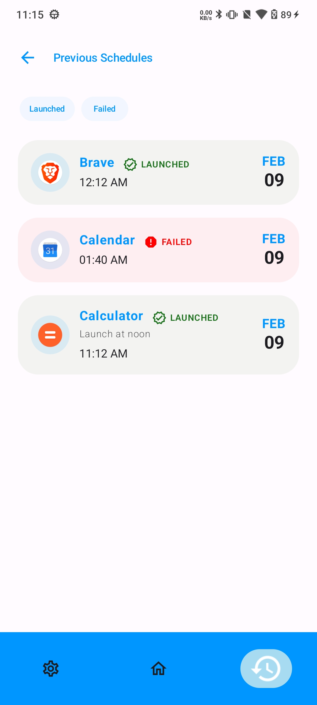

# AppClock

AppClock is an Android application that allows users to schedule installed apps to launch at a
specific time. The app ensures reliable scheduling and execution tracking, even when the UI is not
running.

## Features

- **Schedule App Launch**: Select an installed app and set a launch time
- **Modify or Cancel Schedules**: Edit or delete existing schedules
- **Multiple Schedule Support**: Schedule multiple apps at once
- **Execution Tracking**: Maintain a record of scheduled execution status
- **Accurate Tracking**: UsageStatsManager for accurate tracking of app launch
- **Launch Notifications**: Send notification after app launch

## Tech Stack

- **Jetpack Compose**: For designing UI
- **Hilt (Dagger)**: Dependency Injection library
- **Room**: Local database to store data
- **Architecture**: Clean Architecture with MVVM pattern

## Required Permission

- SCHEDULE_EXACT_ALARM: To schedule alarm at exact time
- SYSTEM_ALERT_WINDOW: To launch other apps when in background
- PACKAGE_USAGE_STATS: To track app launches accurately
- POST_NOTIFICATIONS: To show notification after app launch

> **Note:** Permissions may not be requested from the user depending on the OS version or phone model.

## Screenshots

  
  
  

## Future Improvements

- Support for recurring schedules
- Filtering and sorting of schedules
- Additional customization settings
